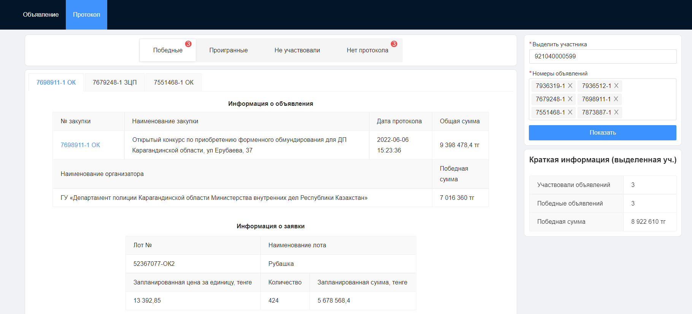
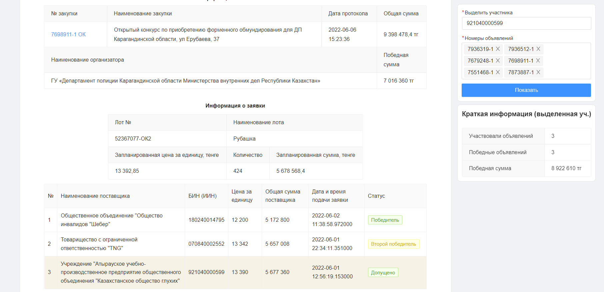

#### Помощник инструмент для госзакупщика для 
## Объявления
- Поиск опубликованные объявлений
- Поиск по наименование лота, номер объявлений, способ закупки, признак закупки
- Возможность фильтровать лоты по КП ВЭД(для отечественных производителей товаров, работ, услуг (Индустриальный сертификат))
- Скачать все найденные объявление в формате excel(zipped)

## Протокол
- Возможность посмотреть все протоколы одновременно
- Возможность выделение участника по БИН/ИИН/ИНН
- Показать общие данные протокола выделенного участника

###### Страница объявление

###### Все объявления по дате оканчание

###### Объявления из папки

###### Объявление в ексель формате

###### Страница протокола

